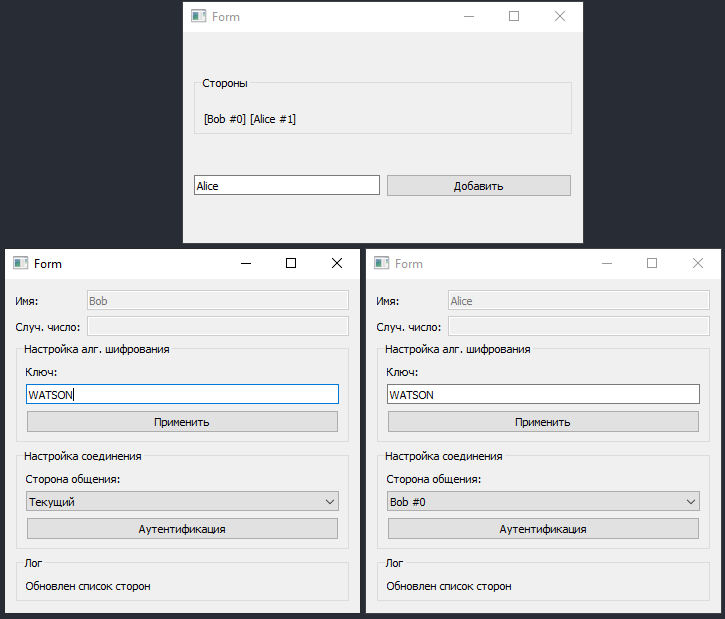

# Strong one-way authentication based on Playfair cipher  
*Строгая двусторонняя аутентификация на основе случайных чисел*

Реализация вышеописанного протокола, где в качестве симметричного алгоритма шифрования используется шифр Плейфера  
Графический интерфес построен на PySide2  
Целевой файл: 1side_auth.py  

